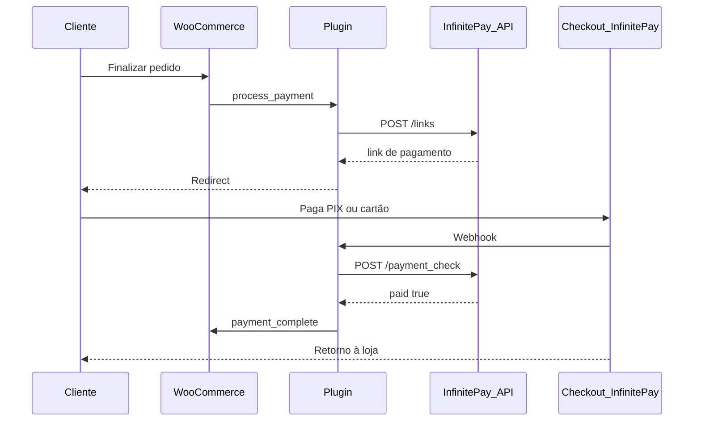

# InfinitePay para WooCommerce

Plugin WordPress que adiciona um **gateway de pagamento** ao WooCommerce usando o [Checkout Integrado InfinitePay](https://www.infinitepay.io/checkout-documentacao). Sua loja gera o pedido; o cliente paga com **PIX** ou **cartão** no checkout hospedado da InfinitePay; o WooCommerce recebe a confirmação automaticamente.

## Recursos

- Redirect para checkout InfinitePay (modelo oficial da API)
- Confirmação de pagamento via **webhook** + validação **`payment_check`**
- Fallback na página de pedido recebido (thank you)
- Compatível com **WooCommerce Blocks** e checkout clássico
- Compatível com **HPOS** (High-Performance Order Storage)
- Pré-preenchimento de dados do comprador e endereço
- URLs de webhook e redirect exibidas no painel
- Log de depuração integrado ao WooCommerce (`source: infinitepay`)

## Requisitos

| Tecnologia   | Versão mínima |
|--------------|---------------|
| WordPress    | 6.0           |
| PHP          | 7.4           |
| WooCommerce  | 7.0           |

Testado até WooCommerce **9.0**.

Você também precisa de uma conta InfinitePay e da sua **InfiniteTag** (handle), configurada no app InfinitePay.

## Instalação

1. Baixe o ZIP da [última release](https://github.com/leofelipet/infinitepay-for-woocommerce/releases/latest) (atualizada automaticamente a cada push na `main`).
2. No WordPress, acesse **Plugins → Adicionar novo → Enviar plugin**.
3. Selecione o arquivo `.zip` baixado e clique em **Instalar agora**.
4. Após a instalação, clique em **Ativar plugin**.
5. Confirme que o **WooCommerce** está instalado e ativo antes de configurar o pagamento.

## Configuração

Acesse **WooCommerce → Ajustes → Pagamentos → InfinitePay**.

| Campo | O que é |
|-------|---------|
| **Ativar InfinitePay** | Exibe o método no checkout |
| **Handle (InfiniteTag)** | Seu usuário no app InfinitePay, **sem** o `$` |
| **Título / Descrição** | Texto exibido ao cliente no checkout |
| **URL do webhook** | Endpoint fixo da loja (somente leitura) — use na InfinitePay |
| **URL de redirect** | Padrão da página “pedido recebido” por pedido |
| **Log de depuração** | Registra requisições em *WooCommerce → Status → Logs* |

### Checklist pós-instalação

1. Ativar o gateway e salvar o handle correto.
2. Fazer um pedido de teste com **valor baixo**.
3. Confirmar que o pedido fica `pending` e redireciona para a InfinitePay.
4. Após pagar, verificar se o pedido vai para `processing` ou `completed`.
5. Em ambiente local, use túnel (ngrok, Local Connect, etc.) se precisar testar o webhook.

## Como funciona



1. O pedido WooCommerce é criado como **aguardando pagamento**.
2. O plugin chama `https://api.checkout.infinitepay.io/links` com handle, itens (centavos), `order_nsu`, webhook e redirect.
3. O cliente paga no ambiente InfinitePay.
4. O webhook dispara; o plugin confirma com `payment_check` antes de marcar o pedido como pago.

## Estrutura do projeto

```
infinitepay/
├── infinitepay.php              # Bootstrap do plugin
├── readme.txt                   # Formato WordPress.org
├── AGENTS.md                    # Guia técnico para desenvolvimento
├── includes/
│   ├── class-infinitepay-gateway.php
│   ├── class-infinitepay-api.php
│   ├── class-infinitepay-order.php
│   ├── class-infinitepay-webhook.php
│   └── class-infinitepay-blocks-support.php
├── assets/js/
│   └── infinitepay-blocks.js    # Checkout em blocos
└── languages/                   # Traduções (text domain: infinitepay)
```

## Desenvolvimento

Documentação técnica, decisões de arquitetura e endpoints da API estão em [AGENTS.md](./AGENTS.md).

```bash
# Exemplo: clonar e ativar no ambiente local
cd wp-content/plugins/infinitepay
```

## FAQ

**O pagamento acontece dentro do meu site?**  
Não. O cliente é redirecionado para o checkout InfinitePay. Isso segue o Checkout Integrado documentado oficialmente.

**Funciona com checkout em blocos?**  
Sim. O plugin registra integração com WooCommerce Blocks.

**Preciso de API key?**  
No fluxo documentado do Checkout Integrado, a loja se identifica pelo **handle** (InfiniteTag). Não há secret no payload público usado por este plugin.

**E se o webhook não chegar?**  
O retorno na página de pedido recebido (com parâmetros da InfinitePay) tenta confirmar o pagamento pelo mesmo fluxo de `payment_check`.

## Links úteis

- [Documentação InfinitePay — Checkout Integrado](https://www.infinitepay.io/checkout-documentacao)
- [WooCommerce — Payment Gateway API](https://developer.woocommerce.com/docs/features/payments/payment-gateway-api/)

## Licença

Este projeto está licenciado sob **GPL-2.0-or-later**.  
Veja [GNU GPL v2](https://www.gnu.org/licenses/gpl-2.0.html).

## Autor

**Léo Felipe**  
Contato: [WhatsApp](https://wa.me/5514981453663)

---

Desenvolvido para integrar WooCommerce ao ecossistema InfinitePay de forma simples e alinhada à documentação oficial.
